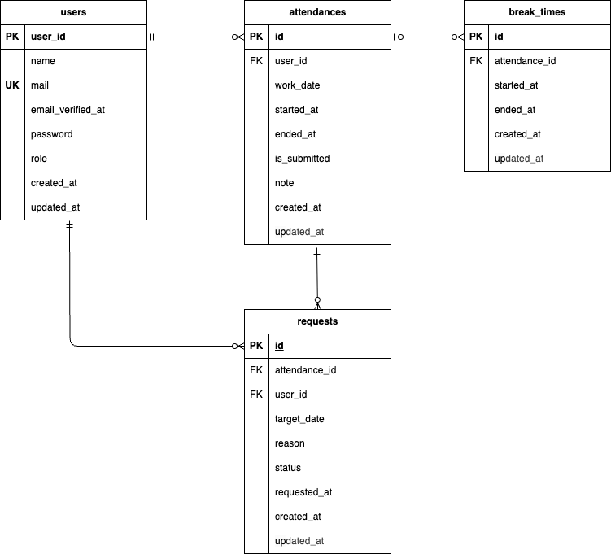

# coachtech-attendance

## 環境構築

**Docker ビルド**

1. `git clone git@github.com:Haruki1799/coachtech-attendance.git`
2. DockerDesktop アプリを立ち上げる
3. `docker-compose up -d --build`

> _Mac の M1・M2 チップの PC の場合、`no matching manifest for linux/arm64/v8 in the manifest list entries`のメッセージが表示されビルドができないことがあります。
> エラーが発生する場合は、docker-compose.yml ファイルの「mysql」内に「platform」の項目を追加で記載してください_

```bash
mysql:
    platform: linux/x86_64(この文追加)
    image: mysql:8.0.26
    environment:
```

**Laravel 環境構築**

1. `docker-compose exec php bash`
2. `composer install`
3. 「.env.example」ファイルを 「.env」ファイルに命名を変更。または、新しく.env ファイルを作成
4. .env に以下の環境変数を追加

```text
DB_CONNECTION=mysql
DB_HOST=mysql
DB_PORT=3306
DB_DATABASE=laravel_db
DB_USERNAME=laravel_user
DB_PASSWORD=laravel_pass
```

5. アプリケーションキーの作成

```bash
php artisan key:generate
```

6. マイグレーションの実行

```bash
php artisan migrate
```

7. シーディングの実行

```bash
php artisan db:seed
```

8. MailHog の設定.env に以下の環境変数を追加

```text
MAIL_MAILER=smtp
MAIL_HOST=mailhog
MAIL_PORT=1025
MAIL_USERNAME=null
MAIL_PASSWORD=null
MAIL_ENCRYPTION=null
MAIL_FROM_ADDRESS="admin@example.com"
MAIL_FROM_NAME="${APP_NAME}"
```

## テストユーザー情報（初期データ）

シーディング実行後、以下のテストユーザーが登録されています：

| ユーザー名       | メールアドレス    | パスワード |ロール  |
| ---------------- | ----------------- | ---------- || ------- |
| テストユーザ   | test@gmail.com  | password   |user   |
| テストユーザ 2 | test2@gmail.com | password   |user   |
| 管理者 | root@gmail.com | password   |admin   |

> ※パスワードはすべて暗号化されて登録されています。ログイン時は上記の平文を使用してください。

## PHPUnitテストについて

以下のコマンド:
```
//テスト用データベースの作成
docker-compose exec mysql bash
mysql -u root -p
//パスワードはrootと入力
create database demo_test;

docker-compose exec php bash
php artisan migrate:fresh --env=testing
php artisan config:clear
php artisan migrate --env=testing

```

## 使用技術(実行環境)

- PHP 8.1.33
- Lavavel 8.83.29
- MySQL8.0.26

## ER 図



## URL

- 開発環境：http://localhost/
- phpMyAdmin:：http://localhost:8080/
- mailHog: http://localhost:8025/